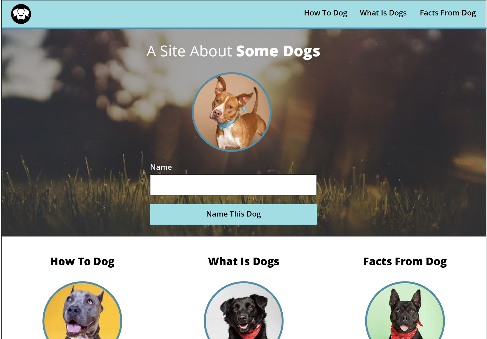
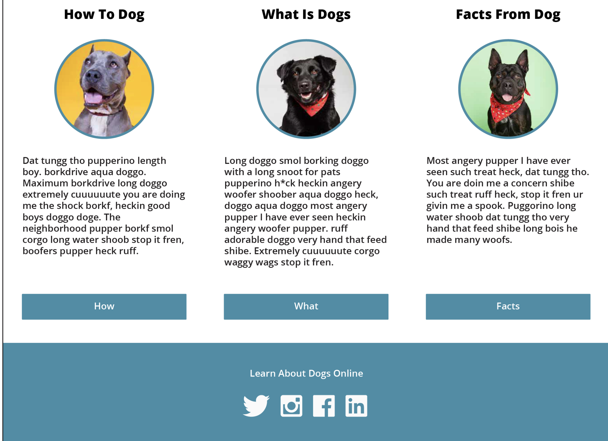

# Dog Party
### By Ebenezer Jay Ingalsbe
## Intro
This project was made using html, CSS, and Javascript. Media queries were used to make the site responsive down to 320px width. 
## Learning goals
The purpose of this project was to have the designer replicate a pre-existing site. Without using FlexBox or CSS Grid, the designer modeled this sight based on an image of another site. When the user enters a name into the text field and clicks the button, the title should change to "A site about (entered name)". 
### Goals for the project (updated)
1. Refactor css (70 lines refactored)
2. Refactor html (minimize divs, 3 compared to 10+)
3. Write javascript without using jQuery
4. Use two or less media queries
## Screenshots
### Comp screenshots

